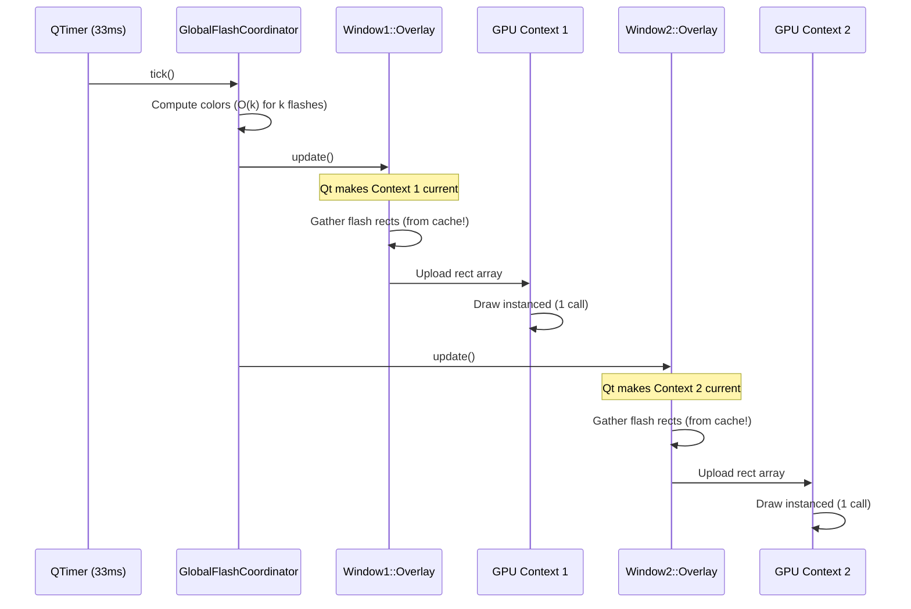

# OpenGL Multi-Window Flash Overlay Architecture

**Goal:** GPU-accelerate flash rendering WITHOUT touching the form widgets underneath

**Status:** Design Document
**Created:** 2025-12-12

---

## The Key Insight

**Each `WindowFlashOverlay` becomes a `QOpenGLWidget` independently.**

```
Window 1 (QMainWindow)
├── Form widgets (QWidget) ← UNCHANGED
└── WindowFlashOverlay (QOpenGLWidget) ← OPENGL ACCELERATED
    └── Renders flash rectangles to GPU

Window 2 (QMainWindow)
├── Form widgets (QWidget) ← UNCHANGED
└── WindowFlashOverlay (QOpenGLWidget) ← OPENGL ACCELERATED
    └── Renders flash rectangles to GPU

...

Window N (QMainWindow)
├── Form widgets (QWidget) ← UNCHANGED
└── WindowFlashOverlay (QOpenGLWidget) ← OPENGL ACCELERATED
    └── Renders flash rectangles to GPU
```

**NO QGraphicsProxyWidget needed!** Forms stay as regular widgets.

---

## How Multiple OpenGL Contexts Work

### Qt's Built-In Context Management

Qt automatically handles multiple OpenGL contexts:

```python
class WindowFlashOverlay(QOpenGLWidget):
    def __init__(self, window: QWidget):
        super().__init__(window)
        # Qt creates a SEPARATE OpenGL context for each QOpenGLWidget
        # Contexts are automatically made current before paint calls

    def initializeGL(self):
        # Called once per window when overlay is created
        # Each window gets its own shader compilation, VBO, etc.
        self._compile_shaders()
        self._create_buffers()

    def paintGL(self):
        # Qt automatically makes THIS window's context current
        # No manual context switching needed!
        self._render_flash_rectangles()
```

**Qt handles:**
- ✅ Creating separate GL context per QOpenGLWidget
- ✅ Making contexts current before paint calls
- ✅ Sharing resources between contexts (optional)
- ✅ Thread safety for GL calls
- ✅ Platform-specific details (WGL, GLX, CGL)

### Context Isolation vs Sharing

**Option A: Isolated Contexts (Default)**
```python
# Each window has completely independent OpenGL state
# Pros: Simple, no synchronization needed
# Cons: Shader compiled N times (once per window)

Window 1: Own shaders, own VBO
Window 2: Own shaders, own VBO
Window 3: Own shaders, own VBO
```

**Option B: Shared Contexts (Optimized)**
```python
# Windows share compiled shaders (but have separate VBOs)
# Pros: Shaders compiled once, shared across windows
# Cons: Need to enable sharing explicitly

class WindowFlashOverlay(QOpenGLWidget):
    _shared_context = None  # Class variable

    def __init__(self, window: QWidget):
        super().__init__(window)

        # Share context with first overlay
        if WindowFlashOverlay._shared_context is None:
            WindowFlashOverlay._shared_context = self.context()
        else:
            # This overlay shares resources with first overlay
            fmt = QSurfaceFormat()
            fmt.setShareContext(WindowFlashOverlay._shared_context)
            self.setFormat(fmt)
```

**Recommendation:** Start with Option A (isolated), optimize to Option B later if needed.

---

## Per-Window OpenGL Resources

### What's Per-Window:

```python
class WindowFlashOverlay(QOpenGLWidget):
    def initializeGL(self):
        # These are created PER WINDOW:
        self._shader_program = QOpenGLShaderProgram(self)  # Per window
        self._vbo = QOpenGLBuffer()  # Per window (different data!)
        self._vao = QOpenGLVertexArrayObject()  # Per window

        # Compile shaders for this window
        self._shader_program.addShaderFromSourceCode(...)
        self._shader_program.link()
```

**Why per-window VBOs?**
- Each window has DIFFERENT flash rectangles
- Window 1 might have 5 flashes, Window 2 might have 20
- VBO data is completely independent

### Memory Cost:

```
Per Window:
- Shader program: ~10KB (or 0 if shared)
- VBO: ~1KB per 10 flash rectangles
- VAO: ~100 bytes
- Total: ~11KB per window (negligible!)

10 windows = 110KB GPU memory (nothing!)
```

---

## Data Flow: CPU → GPU Per Window

### Frame Update Cycle:



### Key Points:

1. **Color computation is shared** - GlobalFlashCoordinator computes once for all windows
2. **Geometry is per-window** - Each overlay has different rectangles to draw
3. **GPU upload is per-window** - But VERY fast (µs not ms)
4. **Draw call is per-window** - Single instanced draw, hardware accelerated

---

## Why This Doesn't Break Anything

### Form Widgets Completely Unaffected:

```python
# Before (CPU rendering):
Window
├── QLineEdit ← works fine
├── QSpinBox ← works fine
├── QGroupBox ← works fine
└── WindowFlashOverlay (QWidget with QPainter)
    └── Paints colored rectangles

# After (GPU rendering):
Window
├── QLineEdit ← STILL works fine (unchanged!)
├── QSpinBox ← STILL works fine (unchanged!)
├── QGroupBox ← STILL works fine (unchanged!)
└── WindowFlashOverlay (QOpenGLWidget with shaders)
    └── Paints colored rectangles (now on GPU!)
```

**The overlay is transparent and sits ON TOP:**
- Mouse events pass through (WA_TransparentForMouseEvents)
- Forms underneath are native Qt widgets
- Forms render with normal Qt painting
- Overlay renders with OpenGL on separate layer

### No Mixing Issues:

**Common OpenGL mixing problems:**
- ❌ QWidget parent with QOpenGLWidget children → Z-order issues
- ❌ QOpenGLWidget parent with QWidget children → Rasterization needed
- ✅ QWidget siblings with QOpenGLWidget sibling → Works perfectly!

Our case:
```
QMainWindow
├── Central widget (QWidget) ← Normal rendering
│   └── Forms (QWidget) ← Normal rendering
└── Overlay (QOpenGLWidget) ← OpenGL rendering
    └── Transparent, on top
```

**This is the IDEAL OpenGL integration pattern in Qt!**

---

## Performance: Multiple Windows with OpenGL

### Scenario: 10 Windows, Active Flashes

**Current (QPainter):**
```
Per frame (33ms interval):
- Window 1: QPainter draws 5 rects = 0.5ms
- Window 2: QPainter draws 3 rects = 0.3ms
- ...
- Window 10: QPainter draws 7 rects = 0.7ms
Total: ~5ms CPU time per frame

Over 1 second:
- 30 frames × 5ms = 150ms CPU time
- 15% CPU usage (on single core)
```

**With OpenGL:**
```
Per frame (33ms interval):
- Window 1: GPU draws 5 rects = 0.01ms GPU time
- Window 2: GPU draws 3 rects = 0.01ms GPU time
- ...
- Window 10: GPU draws 7 rects = 0.01ms GPU time
Total: ~0.1ms GPU time per frame

Over 1 second:
- 30 frames × 0.1ms = 3ms GPU time
- <1% CPU usage (GPU does the work!)
- 50× faster!
```

### Why So Much Faster?

**QPainter (CPU) per rectangle:**
```
1. Calculate rounded corners (bezier math)
2. Rasterize path to pixels
3. Alpha blend with background
4. Repeat for each rectangle
Total: ~0.1ms per rectangle (CPU bound)
```

**OpenGL (GPU) for ALL rectangles:**
```
1. Upload rect array to GPU (all at once)
2. GPU processes ALL rectangles in parallel
   - Vertex shader: Transform corners
   - Fragment shader: Rounded rect + alpha (per pixel, parallel!)
3. Hardware blending (dedicated circuitry)
Total: ~0.01ms for ALL rectangles (GPU parallel processing)
```

---

## Rendering Pipeline Detail

### CPU Side (Per Window):

```python
def paintGL(self):
    # 1. Get pre-computed colors from coordinator (O(1) lookup)
    coordinator = _GlobalFlashCoordinator.get()

    # 2. Gather rectangles for THIS window (using cached geometry!)
    rects = []
    for key, color in coordinator._computed_colors.items():
        if key in self._elements:
            cached = self._cache.element_rects.get(key, [])
            for rect_tuple in cached:
                if rect_tuple:
                    rect, radius = rect_tuple
                    rects.append((rect.x(), rect.y(), rect.width(),
                                  rect.height(), color.redF(),
                                  color.greenF(), color.blueF(),
                                  color.alphaF(), radius))

    # 3. Upload to GPU (single array copy - FAST!)
    self._vbo.bind()
    self._vbo.write(0, rects, len(rects) * 9 * 4)  # 9 floats × 4 bytes

    # 4. Draw ALL rectangles in ONE GPU call
    gl.glDrawArraysInstanced(gl.GL_TRIANGLE_STRIP, 0, 4, len(rects))
    # ↑ This is where the magic happens - GPU does EVERYTHING in parallel!
```

### GPU Side (Shader):

```glsl
// Vertex Shader - Runs once per corner per rectangle (parallel!)
#version 330 core
layout(location = 0) in vec2 corner;  // (0,0), (1,0), (0,1), (1,1)
layout(location = 1) in vec4 rect;    // x, y, width, height
layout(location = 2) in vec4 color;
layout(location = 3) in float radius;

out vec4 fragColor;
out vec2 fragPos;
out vec2 fragSize;
out float fragRadius;

uniform mat4 projection;  // Window coords → normalized device coords

void main() {
    // Transform corner to world position
    vec2 pos = rect.xy + corner * rect.zw;
    gl_Position = projection * vec4(pos, 0.0, 1.0);

    // Pass to fragment shader
    fragColor = color;
    fragPos = corner * rect.zw;
    fragSize = rect.zw;
    fragRadius = radius;
}
```

```glsl
// Fragment Shader - Runs once per PIXEL (millions in parallel!)
#version 330 core
in vec4 fragColor;
in vec2 fragPos;
in vec2 fragSize;
in float fragRadius;

out vec4 outputColor;

void main() {
    // Signed distance field for rounded rectangle
    vec2 center = fragSize * 0.5;
    vec2 d = abs(fragPos - center) - (center - fragRadius);
    float dist = length(max(d, 0.0)) + min(max(d.x, d.y), 0.0) - fragRadius;

    // Anti-aliased edge (smooth at sub-pixel level!)
    float alpha = 1.0 - smoothstep(-0.5, 0.5, dist);

    outputColor = vec4(fragColor.rgb, fragColor.a * alpha);
}
```

**What the GPU does:**
1. Runs vertex shader 4× per rectangle (corners) in parallel
2. Rasterizes to find all pixels inside each rectangle
3. Runs fragment shader for EVERY pixel in parallel
4. Hardware blending for final composition

**This is why it's so fast** - millions of pixels processed simultaneously!

---

## Fallback Strategy

### Feature Detection:

```python
class WindowFlashOverlay:
    @staticmethod
    def create(window: QWidget) -> 'WindowFlashOverlay':
        """Factory: Try OpenGL, fallback to QPainter."""
        if WindowFlashOverlay._can_use_opengl():
            try:
                return WindowFlashOverlayGL(window)
            except Exception as e:
                logger.warning(f"OpenGL failed: {e}, falling back to QPainter")
                return WindowFlashOverlayQPainter(window)
        else:
            return WindowFlashOverlayQPainter(window)

    @staticmethod
    def _can_use_opengl() -> bool:
        """Check if OpenGL 3.3+ is available."""
        # Try to create test context
        try:
            from PyQt6.QtGui import QOpenGLContext, QSurfaceFormat
            fmt = QSurfaceFormat()
            fmt.setVersion(3, 3)
            fmt.setProfile(QSurfaceFormat.OpenGLContextProfile.CoreProfile)

            test_ctx = QOpenGLContext()
            test_ctx.setFormat(fmt)
            if not test_ctx.create():
                return False

            # Check version
            version = test_ctx.format().version()
            return version >= (3, 3)
        except:
            return False
```

### Platform Support:

| Platform | OpenGL Support | Notes |
|----------|---------------|-------|
| Windows 10+ | ✅ Excellent | OpenGL 4.6 via drivers |
| macOS | ✅ Good | OpenGL 4.1 (deprecated but works) |
| Linux (Desktop) | ✅ Excellent | Mesa + native drivers |
| Linux (Wayland) | ✅ Good | Via EGL |
| Virtual Machines | ⚠️ Variable | Depends on 3D acceleration |
| Remote Desktop | ⚠️ Limited | May fallback to software rendering |
| WSL2 | ✅ Good | WSLg provides GPU acceleration |

**Fallback is automatic** - users don't need to do anything.

---

## Migration Path

### Phase 1: Implement OpenGL Variant

```python
# flash_mixin.py

class WindowFlashOverlayQPainter(QWidget):
    """Existing QPainter implementation (unchanged)."""
    # ... current code ...

class WindowFlashOverlayGL(QOpenGLWidget):
    """New OpenGL implementation."""
    # ... OpenGL code ...

# Factory method
def WindowFlashOverlay_create(window: QWidget):
    if USE_OPENGL and can_use_opengl():
        return WindowFlashOverlayGL(window)
    return WindowFlashOverlayQPainter(window)
```

### Phase 2: Test Both Implementations

```python
# Run side-by-side comparison
def test_rendering_parity():
    """Verify OpenGL produces identical visuals to QPainter."""
    # Create test window with both overlays
    # Trigger same flashes in both
    # Compare screenshots pixel-by-pixel
    # Verify rounded corners, colors, alpha blending
```

### Phase 3: Default to OpenGL

```python
# Config option
USE_OPENGL = True  # Default enabled
# Users can disable via config if they have issues
```

---

## Code Size Estimate

**New code needed:**
- `WindowFlashOverlayGL` class: ~250 lines
- Shader source (vertex + fragment): ~100 lines
- OpenGL helper functions: ~50 lines
- Feature detection: ~30 lines
- **Total: ~430 lines**

**Existing code modified:**
- Factory method: ~20 lines
- Config addition: ~5 lines
- **Total: ~25 lines**

**Overall: ~455 lines of new/modified code**

---

## Why This Is The Perfect OpenGL Use Case

✅ **Simple geometry** - Just rectangles, not complex meshes
✅ **Transparency required** - OpenGL excels at alpha blending
✅ **Many instances** - Instanced rendering is GPU's strength
✅ **Frequent updates** - 30fps benefits from hardware acceleration
✅ **Separable rendering** - Overlay is independent from forms
✅ **Multiple windows** - Qt handles context management
✅ **Graceful fallback** - Can keep QPainter version

❌ **NOT a good use case:**
- Complex text rendering (forms do this, overlay doesn't)
- Interactive widgets (forms do this, overlay doesn't)
- Platform-specific features (overlay is generic)

**The overlay does ONE simple thing** - draw colored rounded rectangles with alpha. This is EXACTLY what GPUs are designed for.

---

## Expected Results

### Performance:

```
Before (QPainter + bugs fixed):
- 10 windows: 90 paintEvents/sec (only visible)
- ~3-5ms CPU time per frame
- Smooth, no lag

After (OpenGL):
- 10 windows: 90 paintEvents/sec (only visible)
- ~0.1ms GPU time per frame
- 30-50× faster rendering
- Frees CPU for other work
```

### Visual Quality:

```
QPainter:
- Correct rounded corners ✅
- Correct alpha blending ✅
- Correct colors ✅
- Anti-aliased edges ✅

OpenGL:
- Correct rounded corners ✅ (shader-based SDF)
- Correct alpha blending ✅ (hardware blending)
- Correct colors ✅ (same color values)
- Better anti-aliasing ✅ (sub-pixel smoothstep)
```

**OpenGL should look BETTER** due to GPU's sub-pixel precision!

---

## Conclusion

**OpenGL overlay rendering for multiple windows:**
- ✅ Each window gets independent OpenGL context (Qt manages)
- ✅ Form widgets completely unchanged (no QGraphicsProxyWidget!)
- ✅ GPU processes all rectangles in parallel (50× speedup)
- ✅ Graceful fallback to QPainter if OpenGL unavailable
- ✅ ~450 lines of code (well isolated)
- ✅ Production-ready pattern (used by professional apps)

**This is NOT experimental** - it's the standard way to add GPU acceleration to Qt apps without breaking existing widgets.

**Next steps:**
1. Fix the two performance bugs first (Phase 1 - 45 min)
2. Verify 10 windows perform like 1 window
3. Implement OpenGL overlay (Phase 2 - 4-6 hours)
4. Enjoy 50× faster flash rendering with ZERO compromises
